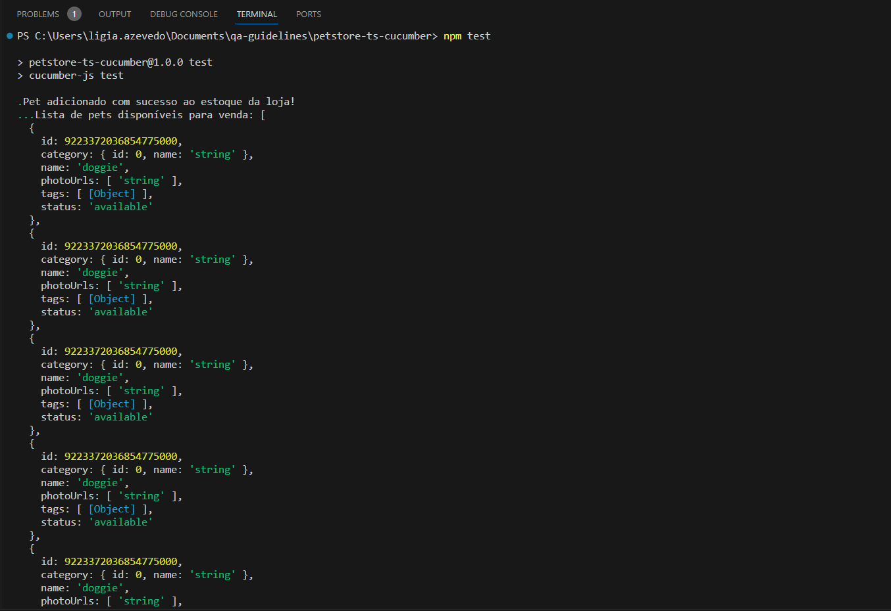
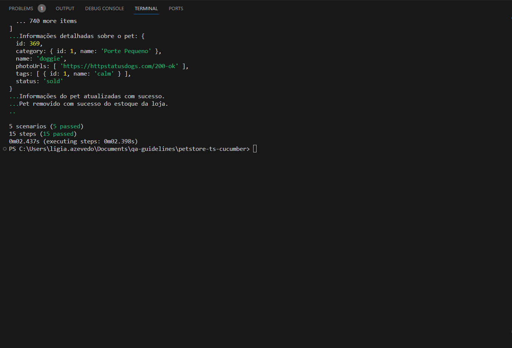
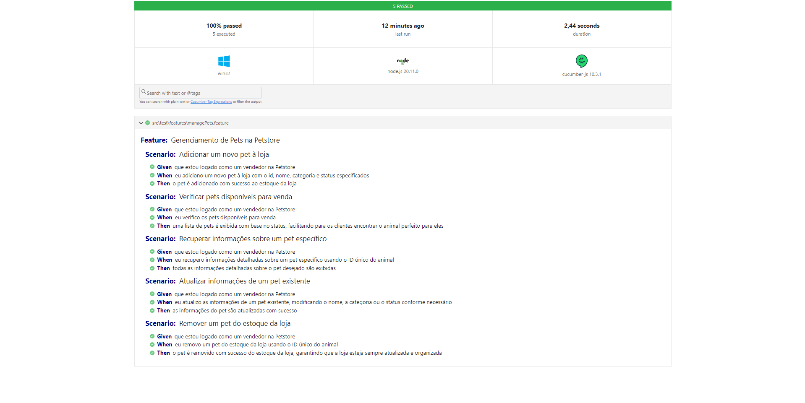

## **⚠️ Description**

Esse projeto é um template para testes utilizando a ferramenta Cucumber e linguagem Gherkin.

## **📚 Resources**

Utilizando o modelo da API Petstore [Petstore](https://petstore.swagger.io/#/), apresenta no arquivo managePets.feature(src\test - features) os cenários escritos em linguagem Gherkin, que descrevem as etapas para gerenciar os pets. O arquivo managePetsSteps.ts(src\test - steps) contém as etapas de teste automatizadas escritas em TypeScript usando a biblioteca Cucumber para interagir com a API Petstore e realizar operações de gerenciamento de pets.

## **⚡ Getting Started**

**Instalar o Node.js localmente:**

• [Node.js](https://nodejs.org/en)

**Atentar para o arquivo package.json:** 
O arquivo package.json lista as dependências do projeto. Utilizar um dos comandos abaixo para instalar todas as dependências listadas.
```
npm install 
```
```
npm ci
```

**Executar:** 
```
npm test
```

## **🎯Resultados Obtidos:**

**Após execução do comando npm test no terminal - Parte I:**


**Após execução do comando npm test no terminal - Parte II:**


**Relatório de Testes salvo automaticamente em formato .html:**


